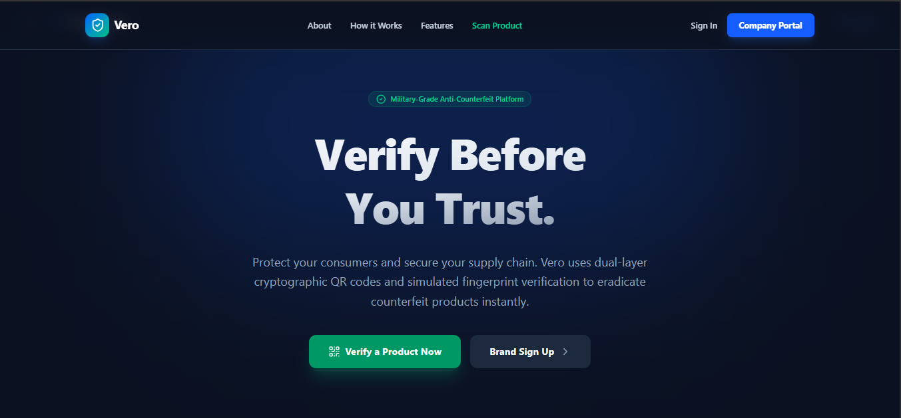
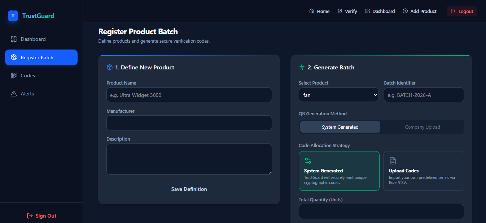
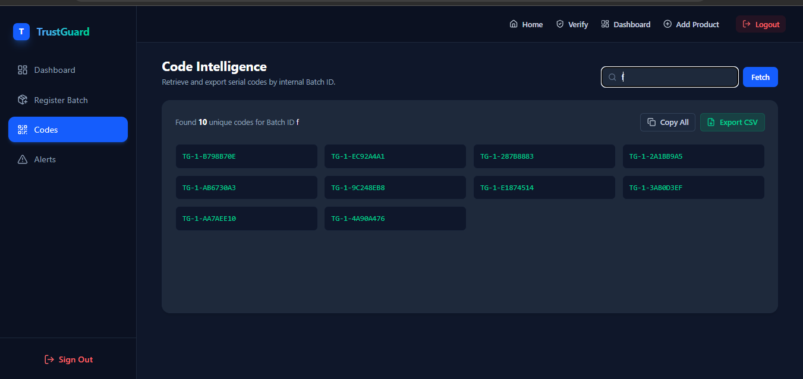
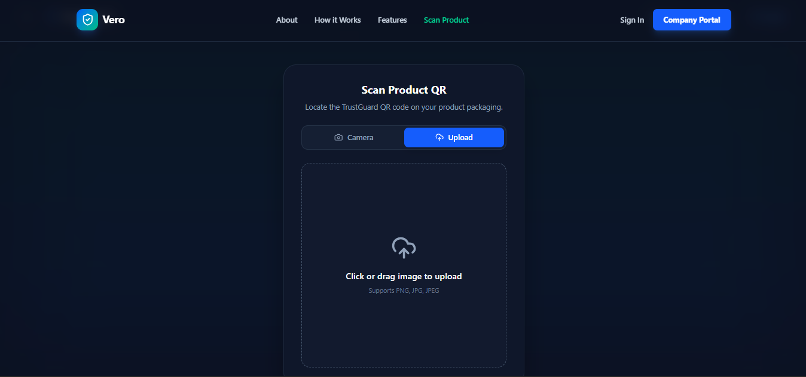
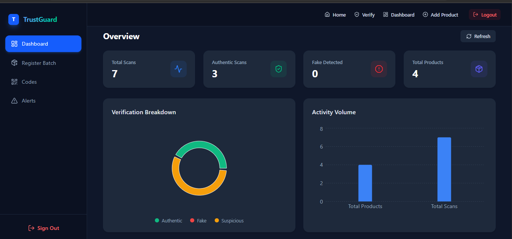
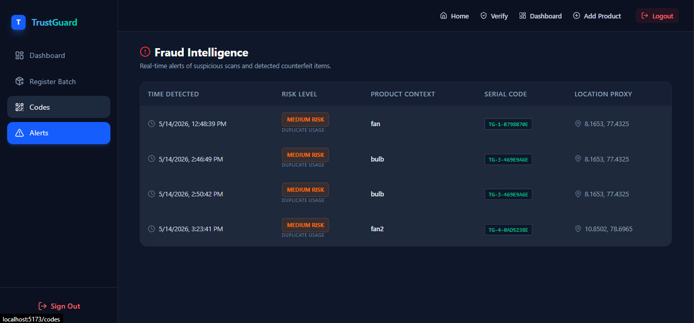
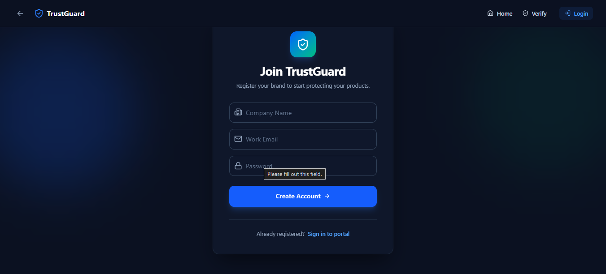
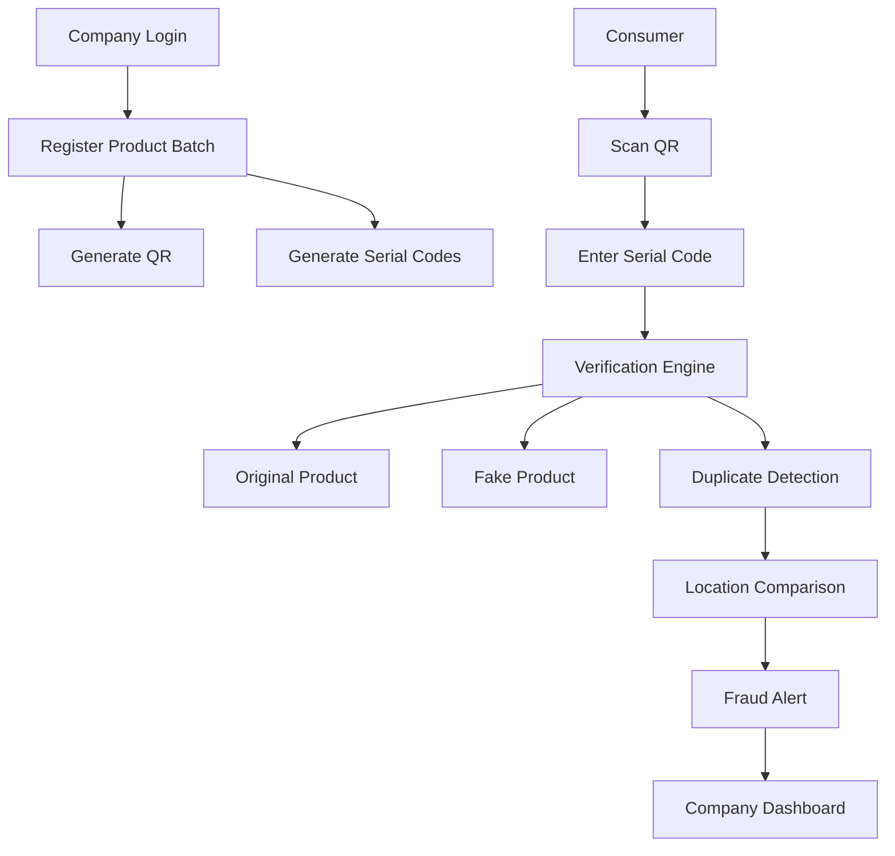

<div align="center">

# 🛡️ Vero

### Verify Before You Trust.


<br>


</div>

---

# 🏆 Achievement

🥇 **1st Place Winner**

**Idea to Incubation**

Conducted as part of **Sathak Thiruvizha**

📍 Mohamed Sathak A.J. College of Engineering, Chennai

---

# 🚀 About Vero

Counterfeit products continue to cause massive financial losses to businesses while putting consumers at risk.

Vero is a full-stack anti-counterfeit verification platform that enables brands to authenticate products using a secure dual-layer verification mechanism.

Unlike traditional QR verification systems, Vero combines:

✅ Batch-Level QR Verification

✅ Unit-Level Unique Serial Codes

✅ Location-Based Fraud Detection

✅ Real-Time Alerts

✅ Analytics Dashboard

This makes cloning products significantly harder while helping businesses identify counterfeit distribution channels.

---

# ✨ Core Features

## 🔐 Dual-Layer Verification

Each batch receives:

- One secure QR Code
- Multiple unique serial codes

Consumers must:

1. Scan QR
2. Enter serial code

Only then is authenticity verified.

---

## 📍 Location-Based Fraud Detection

When a product is scanned:

- Location is captured
- Verification history is checked

If the same code is scanned again from a different location:

🚨 Fraud Alert Generated

🚨 Company Notified

🚨 Detection Appears on Dashboard

---

## 📊 Analytics Dashboard

Track:

- Total Products
- Total Scans
- Valid Products
- Fake Detections
- Suspicious Activities
- Duplicate Scans

---

## 🏢 Brand Portal

Brands can:

- Register products
- Generate QR codes
- Generate serial codes
- View fraud alerts
- Monitor analytics

---

# 🖼️ Project Screenshots

## Landing Page



---

## QR Generation



---

## Code Fetch



---

## Consumer Scanner



---

## Dashboard



---

## Fraud Detection



---

## Registeration



---

# 🏗️ System Architecture



# ⚙️ Tech Stack

## Frontend

- React.js
- Tailwind CSS
- html5-qrcode
- Recharts

## Backend

- Java
- Spring Boot
- Spring Security
- JWT Authentication

## Database

- MySQL

## Deployment

- Vercel
- Render
- Railway

---

# 📁 Project Structure

```bash
vero/
│
├── frontend/
│   ├── src/
│   ├── components/
│   ├── pages/
│   └── services/
│
├── backend/
│   ├── controller/
│   ├── service/
│   ├── repository/
│   ├── entity/
│   └── security/
│
└── database/
```

# 🚀 Getting Started

## Clone Repository

```bash
git clone https://github.com/jenisha35/vero.git
```

---

## Frontend

```bash
cd frontend

npm install

npm run dev
```

---

## Backend

```bash
cd backend

./mvnw spring-boot:run
```

---

## MySQL

Create database:

```sql
CREATE DATABASE trustguard;
```

Update:

```properties
application.properties
```

```properties
spring.datasource.url=
spring.datasource.username=
spring.datasource.password=
```

---

# 🔮 Future Roadmap

- NFC Verification
- AI Product Fingerprinting
- Blockchain Verification
- Enterprise ERP Integration
- Mobile Application
- Global Product Registry

---

# 👨‍💻 Authors

## Author 1

Name: Jenisha S

GitHub: https://github.com/jenisha35

LinkedIn: https://www.linkedin.com/in/jenisha03

Email: jenisha.9530@gmail.com

---

## Author 2

Name: Janani S

GitHub: https://github.com/jananiaiml

LinkedIn: https://www.linkedin.com/in/janani-s-b47b1b292

Email: jananiaiml@gmail.com


---

## Author 3

Name: Venkat Kumar K

GitHub: https://github.com/kvvenkat07

LinkedIn: https://www.linkedin.com/in/venkat-kumar-k-8673bb376

Email: kvvenkat212@gmail.com

---

# ⭐ Show Your Support

If you like this project:

🌟 Star the repository

🍴 Fork it

🚀 Share it

---

<div align="center">

### Built with ❤️ by Team Vero

"Verify Before You Trust."

</div>
